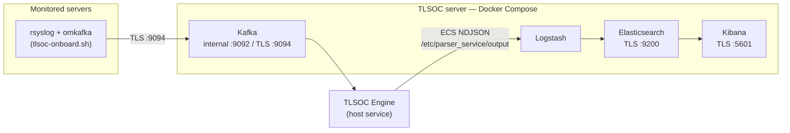

<p align="center">
  
</p>

<h1 align="center">TLSOC Docker Deploy</h1>

<p align="center">
  <b>One-command, TLS-secured SOC core stack — Apache Kafka, Logstash, Elasticsearch, and Kibana on Docker Compose — plus agentless log-source onboarding.</b>
</p>

<p align="center">
  <a href="https://github.com/sankettaware16/tlsoc"></a>
  <a href="LICENSE"></a>
  
  
  
</p>

<p align="center">
  <a href="#getting-started">Getting Started</a> •
  <a href="docs/onboarding.md">Onboard a Server</a> •
  <a href="docs/architecture.md">Architecture</a> •
  <a href="docs/kafka-admin.md">Kafka Cheat Sheet</a> •
  <a href="#tlsoc-ecosystem">Ecosystem</a>
</p>

---

## Overview

TLSOC Docker Deploy is the deployment backbone of the
[TLSOC platform](https://github.com/sankettaware16/tlsoc): a plug-and-play,
TLS-secured SOC stack for **fresh Ubuntu servers**. One installer brings up Kafka,
Logstash, Elasticsearch, and Kibana with all internal communication encrypted using
a **locally generated certificate authority** — no cloud dependencies, no manual
certificate wrangling.

Log collection is **agentless**: the bundled `tlsoc-onboard.sh` script configures any
Linux server to forward its logs with stock `rsyslog` + `omkafka` in one command,
with production safeguards (rotation-safe tailing, no replay bursts, buffered
retry) baked in and end-to-end delivery verified before it exits.

## Key Features

- **One-command install** — `install.sh` auto-detects the host IP, creates `.env`,
  generates the CA and per-service certificates, and starts the stack.
- **TLS everywhere** — Elasticsearch, Kibana, Logstash, and Kafka's external
  listener all speak TLS, signed by a local CA you control.
- **Agentless onboarding** — one command per monitored server; auto-discovers
  common logs (auth, kern, ufw, nginx, apache, mail, fail2ban, auditd, …), lets
  you add custom paths, validates the config before restarting rsyslog, and
  verifies delivery to Kafka with a unique test marker.
- **Rotation-safe, loss-averse forwarding** — inotify file tailing that survives
  rename and copytruncate rotation, saved read-offsets (crash safety), buffered
  infinite retry when the broker is unreachable, and a private rsyslog ruleset
  that prevents forwarded lines from being swallowed by other rules.
- **Engine-ready** — Logstash tails the ECS output of
  [foss-soc-engine](https://github.com/sankettaware16/foss-soc-engine) and indexes it
  over TLS; the Kibana container supports the engine's native TLSOC Parser
  plugin.
- **Ops included** — a [Kafka admin cheat sheet](docs/kafka-admin.md) for topic
  inspection, live watching, and message counts.

## Architecture



Certificates, volumes, ports, and the Logstash pipeline are detailed in
[docs/architecture.md](docs/architecture.md).

## Getting Started

### Prerequisites

- Ubuntu **20.04 / 22.04 / 24.04** — fresh VM or bare metal recommended
- Docker Engine + Docker Compose v2

```bash
sudo apt update && sudo apt upgrade -y
sudo apt install -y ca-certificates curl gnupg lsb-release git openssl
curl -fsSL https://get.docker.com | sudo bash
sudo systemctl enable --now docker
```

### Install

```bash
cd /opt
sudo git clone https://github.com/sankettaware16/TLSOCDockerDeploy.git
cd TLSOCDockerDeploy
sudo chmod +x install.sh
sudo ./install.sh
```

The installer auto-detects the host IP (override it in `.env`), generates the
certificates, and starts the stack.

> **Mandatory after first start:** reset the built-in Elastic passwords and put
> them in `.env`, then restart the stack — the exact commands are in
> [docs/installation.md](docs/installation.md#first-time-password-setup-mandatory).

Then open Kibana at `https://<server-ip>:5601` (user `elastic`).

### Onboard your first log source

On the server whose logs you want to collect:

```bash
curl -fsSL https://raw.githubusercontent.com/sankettaware16/TLSOCDockerDeploy/main/tlsoc-onboard.sh -o tlsoc-onboard.sh
sudo bash tlsoc-onboard.sh
```

The script asks for the TLSOC server IP and topic, auto-discovers logs, and
verifies end-to-end delivery. Manual template and non-interactive rollout:
[docs/onboarding.md](docs/onboarding.md).

## Usage

```bash
docker ps                        # stack status
docker logs kibana -f            # per-service logs (kibana, logstash, elasticsearch, kafka)
docker compose down              # stop
docker compose up -d             # start
```

Verify logs are arriving in Kafka:

```bash
sudo docker exec -it kafka /opt/kafka/bin/kafka-console-consumer.sh \
  --bootstrap-server kafka:9092 --topic <topic>
```

More topic operations: [docs/kafka-admin.md](docs/kafka-admin.md).

## Repository Structure

```
├── install.sh              # One-command installer (IP detection, certs, compose up)
├── docker-compose.yml      # Kafka + Logstash + Elasticsearch + Kibana (TLS)
├── .env.example            # Stack configuration template (versions, passwords, IP)
├── tlsoc-onboard.sh        # Agentless log-source onboarding script
├── certs/
│   └── generate-certs.sh   # Local CA + per-service certificate generation
├── logstash/
│   ├── config/             # logstash.yml, pipelines.yml
│   └── pipeline/           # kafka-to-es.conf (engine output → Elasticsearch)
├── kibana/
│   └── saved_objects/      # Importable dashboards/saved objects
└── docs/                   # Documentation (see below)
```

## Documentation

| Document | Contents |
|---|---|
| [Installation](docs/installation.md) | Prerequisites, install, first-time password setup, verification, troubleshooting |
| [Onboarding](docs/onboarding.md) | Automated and manual log-source onboarding (rsyslog + omkafka) |
| [Architecture](docs/architecture.md) | Services, TLS/certificates, ports, volumes, Logstash pipeline |
| [Kafka Admin](docs/kafka-admin.md) | Topic list/describe/watch/count cheat sheet |
| [Roadmap](docs/roadmap.md) | Planned deployment work |

## TLSOC Ecosystem

TLSOC Docker Deploy is one component of TLSOC, the open-source Security Operations Platform:

| Repository | Purpose |
|---|---|
| [tlsoc](https://github.com/sankettaware16/tlsoc) | Ecosystem home — documentation, architecture, roadmap |
| [foss-soc-engine](https://github.com/sankettaware16/foss-soc-engine) | Log parsing and ECS normalization engine |
| **TLSOCDockerDeploy** (this repository) | TLS-secured core stack (Kafka, Logstash, Elasticsearch, Kibana) |
| [tlsoc-reporting-framework](https://github.com/sankettaware16/tlsoc-reporting-framework) | Declarative executive reporting (HTML/PDF) |

## Roadmap

Highlights — full list in [docs/roadmap.md](docs/roadmap.md):

- Automated first-start password initialization (remove the manual reset step).
- Multi-node Elasticsearch and Kafka profiles.
- Bundled Kibana dashboard pack for the engine's ECS output.

## Contributing

Improvements to the stack, onboarding script, and documentation are welcome — see
[CONTRIBUTING.md](CONTRIBUTING.md). Please note our
[Code of Conduct](CODE_OF_CONDUCT.md).

## Security

Report vulnerabilities privately per [SECURITY.md](SECURITY.md) — never via public
issues.

## License

Free and open-source software under the [Apache License 2.0](LICENSE).

---

<p align="center">
  Built with ❤️ by <b>TrustLab, IIT Bombay</b><br/>
  Part of the <a href="https://github.com/sankettaware16/tlsoc">TLSOC Ecosystem</a>
</p>

<p align="center">
  <a href="https://github.com/sankettaware16/tlsoc">TLSOC</a> •
  <a href="https://github.com/sankettaware16/foss-soc-engine">Engine</a> •
  <a href="https://github.com/sankettaware16/TLSOCDockerDeploy">Deploy</a> •
  <a href="https://github.com/sankettaware16/tlsoc-reporting-framework">Reporting</a>
</p>
