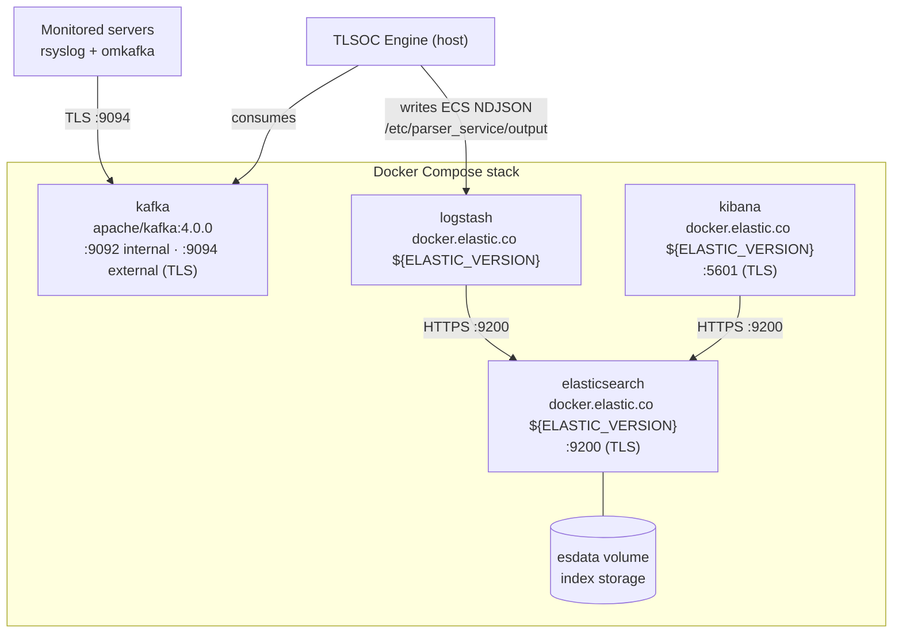

# Stack Architecture

What `docker-compose.yml` deploys and how the pieces connect. For the
platform-wide picture, see
[tlsoc — Architecture](https://github.com/sankettaware16/tlsoc/blob/main/docs/architecture.md).

## Services



| Service | Image | Exposed ports | Role |
|---|---|---|---|
| `kafka` | `apache/kafka:4.0.0` | `9094` (external TLS listener) | Log transport buffer |
| `logstash` | `docker.elastic.co/logstash/logstash:${ELASTIC_VERSION}` | — | Indexes engine output into Elasticsearch |
| `elasticsearch` | `docker.elastic.co/elasticsearch/elasticsearch:${ELASTIC_VERSION}` | `9200` | Storage and search |
| `kibana` | `docker.elastic.co/kibana/kibana:${ELASTIC_VERSION}` | `5601` (`KIBANA_PORT`) | Dashboards and search UI |

Versions and credentials come from `.env` (see
[installation.md](installation.md#configuration-reference-env)).

## TLS and certificates

`certs/generate-certs.sh <server-ip>` creates a **local certificate authority**
and issues per-service certificates signed by it:

```
certs/
├── ca/ca.crt                 # the local CA — import this on clients to trust the stack
├── elasticsearch/            # ES HTTP + transport certs
├── kibana/                   # Kibana server cert
└── logstash/                 # Logstash client certs
```

- All intra-stack communication (Logstash→ES, Kibana→ES) verifies against the
  local CA.
- Kafka's **external** listener (`:9094`) is the only port monitored servers
  need to reach.
- The server IP is baked into the certificates — regenerate them
  (`./certs/generate-certs.sh <new-ip>`) and restart the stack after an IP
  change.
- Browsers warn about the CA until you import `certs/ca/ca.crt` into the trust
  store; the connection is encrypted either way.

## Logstash pipeline

`logstash/pipeline/kafka-to-es.conf` does **not** read Kafka directly — parsing
is the engine's job. Instead it tails the ECS NDJSON files that
[foss-soc-engine](https://github.com/sankettaware16/foss-soc-engine) writes:

```
host: /etc/parser_service/output   →   container: /parser_output (read-only)
```

Pipeline behavior:

- `file` input in `tail` mode with a persistent `sincedb` (no re-indexing on
  restart), JSON codec.
- Promotes the envelope's `meta.server` (falling back to `meta.source_host`)
  into `host.name`.
- Drops `event.original` to halve index storage (the engine already offers
  `output.include_original: false` for the same trade-off at the source).
- Outputs to Elasticsearch over HTTPS with the local CA, into daily indices:
  `all-logs-%{+YYYY.MM.dd}`.

**Two paths must agree:** the engine's `paths.output_dir` and the compose bind
mount source (`/etc/parser_service/output`). If your engine writes elsewhere
(e.g. `/var/log/soc_output/`), edit the bind mount in `docker-compose.yml` — and
update the `path` list in `kafka-to-es.conf` to match your output file names.

The engine also ships an **Elasticsearch index template** that types every ECS
field correctly (dates, IPs, `geo_point`) — load it before the first event is
indexed:
[foss-soc-engine/elasticsearch](https://github.com/sankettaware16/foss-soc-engine/tree/main/elasticsearch).

## Kibana extras

- `kibana/saved_objects/` — importable saved objects (Kibana → Stack Management
  → Saved Objects → Import).
- The Kibana container can host the engine's native **TLSOC Parser plugin**
  (rules/config console inside Kibana):
  [foss-soc-engine/elk-plugin](https://github.com/sankettaware16/foss-soc-engine/tree/main/elk-plugin).

## Data flow summary

1. Monitored servers publish `{meta, raw}` JSON envelopes to Kafka over TLS
   (`:9094`), keyed by `%programname%` so each source stays in one partition.
2. TLSOC Engine (a host service, not a container) consumes the topics, parses
   and normalizes to ECS, and writes NDJSON to the shared output directory.
3. Logstash tails that directory and indexes into Elasticsearch over TLS.
4. Kibana serves dashboards; TLSOC Reporting queries the same indices for daily
   reports.
